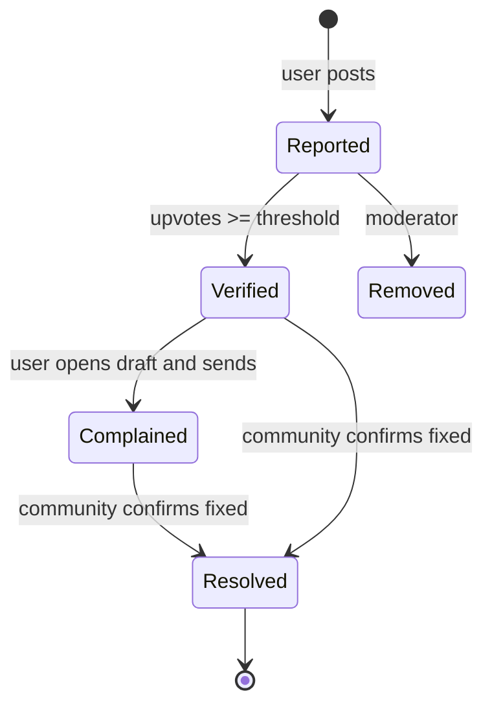
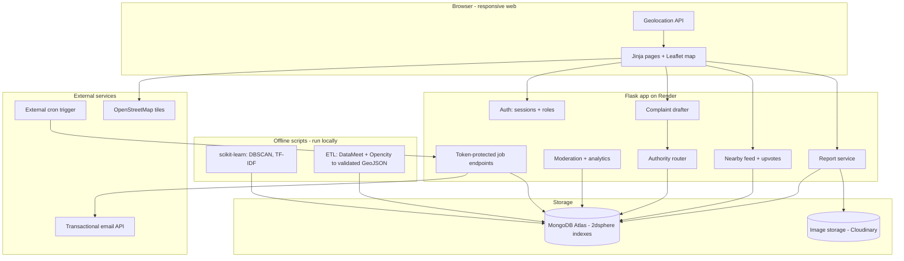
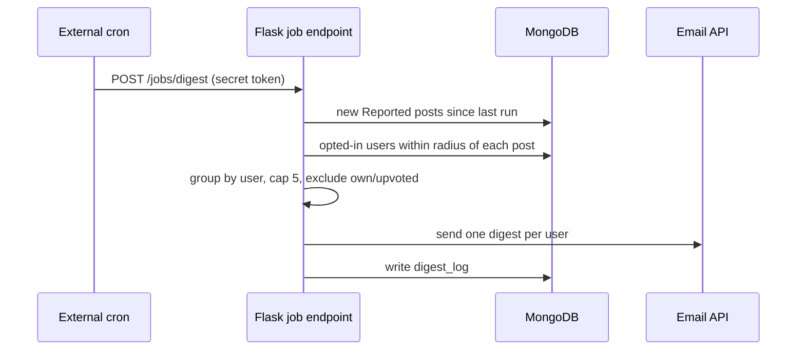

# Geo-Tagged Civic Issue Reporter (GCIR) — PRD v2

**Working title.** Supersedes SCCPS v1.0. Region: Delhi, Greater Noida, Ghaziabad (pilot area to be fixed, see §10).

## 1. Overview
Residents post geo-tagged photos of civic problems (potholes, garbage, water leaks). Nearby residents verify them with upvotes. Once verified, the app drafts a complaint email addressed to the responsible authority for that location and category. Nearby users get a daily email digest asking them to verify new, unverified reports.

**Problem.** Complaints are scattered, unverified and sent to the wrong body. Officials can't tell one-off reports from widespread problems.

## 2. Goals and non-goals
**Goals**
- Fast geo-tagged reporting with a photo
- Community verification instead of ML urgency guessing
- Correct authority lookup by point and category
- Hotspot and duplicate analytics

**Non-goals (v1)**
- Push notifications
- Auto-filing on government portals
- Image classification
- Comments, DMs, profiles
- Native app; regional languages

## 3. Users
| Persona | Need |
|---|---|
| Resident | Report quickly, verify others' reports, get a ready complaint |
| Moderator/Admin | Remove spam, review flagged posts, see analytics |

## 4. Core rules
- **Verification threshold:** `VERIFY_THRESHOLD = 10` (config). Under it, a report is *Reported*; at or above it, *Verified*.
- One upvote per account per report. Login required. Authors can't upvote their own.
- The complaint draft unlocks only at *Verified*.
- Upvoter's last known location should be within ~5 km of the report (soft check: flag, don't block).
- Threshold is unreachable in sparse areas, so keep it configurable per pilot area.

## 5. Functional requirements
**5.1 Reporting**
- Photo, category (dropdown), description
- Location captured via browser Geolocation at submit; manual map pin as fallback
- EXIF GPS is not trusted
- Image uploaded to external storage

**5.2 Nearby feed and map**
- Leaflet map plus list of reports within a chosen radius (`$near`, sorted by distance)
- Filters: category, status, radius

**5.3 Verification**
- Upvote button; count shown; status flips at the threshold

**5.4 Complaint drafter** (only for Verified reports)
- Authority lookup: point-in-polygon on `jurisdictions`, filtered by category, most specific level wins
- Fallback: district or state body, with a "no direct contact found" notice
- Draft includes category, coordinates and map link, photo link, upvote count and number of other reports within 200 m
- Delivery: `mailto:` link plus copy button (no server-sent complaint mail)

**5.5 Email digest**
- Daily job. For each new *Reported* report, find opted-in users whose location is within their radius
- One email per user, max 5 reports: "Nearby issue registered, please take a minute to help verify it"
- Excludes own reports and already-upvoted ones; logged to avoid repeats
- Opt-in at signup, unsubscribe link in every email, delete-account option

**5.6 User location**
- `home_location` is user-set by map pin (preferred)
- `last_login_location` is captured at login with permission; used as fallback
- Desktop and Wi-Fi location can be km off, which is why the home pin takes priority

**5.7 Moderation and analytics**
- Flag/remove reports
- Hotspot map (DBSCAN on coordinates)
- Duplicate suggestions (see §6)

## 6. Data/ML component
| Feature | Method | How it's evaluated |
|---|---|---|
| Hotspots | DBSCAN with haversine metric on report coordinates | Check clusters against known problem areas |
| Duplicate suggestion | Within ~200 m and TF-IDF cosine similarity above tuned threshold | Hand-label ~100 pairs; report precision/recall |
| Data pipeline | GeoPandas: load, validate, reproject, load into MongoDB | Zero invalid geometries; spot-check 20 coordinates |

Rule: a model counts only if you can report a number for it.

## 7. Architecture

**Post flow:** browser gets location, uploads photo to image storage, Flask validates and inserts the report (GeoJSON `[lon, lat]`), then the report appears in nearby feeds.

**Digest flow**

**Complaint flow:** user opens a Verified report; Flask runs `$geoIntersects` on `jurisdictions` with the report point, filters by category, picks the most specific level, and returns a draft. The user sends it from their own mail client.

## 8. Data model (MongoDB)
| Collection | Key fields |
|---|---|
| users | name, email, password_hash, role, home_location (Point), last_login_location (Point), last_login_at, digest_opt_in, digest_radius_km |
| reports | author_id, category, description, photo_url, location (Point), status, upvote_count, cluster_id, duplicate_of, status_log[], created_at |
| upvotes | report_id, user_id, created_at |
| jurisdictions | name, level (ward/sector/district/state), body, categories[], contact_email, geometry (Polygon/MultiPolygon), source, source_date |
| digest_log | user_id, report_ids[], sent_at |

**Indexes:** `2dsphere` on `reports.location`, `users.home_location`, `jurisdictions.geometry`; unique `(report_id, user_id)` on `upvotes`.
**Gotchas:** GeoJSON order is longitude, latitude. Validate polygons before insert. Foreign keys aren't enforced, so validate in code.

## 9. Stack
| Layer | Choice |
|---|---|
| Backend | Python, Flask, PyMongo |
| Frontend | Jinja templates, Leaflet, OSM tiles, vanilla JS |
| Auth | Flask-Login sessions, hashed passwords, role checks |
| Database | MongoDB Atlas (free tier) |
| Images | Cloudinary or similar (free hosts can wipe local disk) |
| Email | Free-tier transactional email API (digests only) |
| Scheduling | External cron calling a token-protected endpoint (free hosts sleep) |
| ML/ETL | GeoPandas, Shapely, scikit-learn (offline scripts) |
| Hosting | Render (app), Atlas (DB); check current free-tier terms |

## 10. Data sources
- **DataMeet India boundaries:** shapefiles under CC BY 4.0, convert with `ogr2ogr`, attribute DataMeet. Believed to be state/district/sub-district level, so verify. Used as fallback jurisdictions.
- **Delhi MCD wards:** Opencity 2022 KML (250 wards, public domain).
- **Noida/Greater Noida/Ghaziabad:** no clean official boundary file found yet. Options: authority sector maps, OSM extracts (partial), manual digitizing.
- **Authority contacts:** hand-built table for the pilot area.
- **Open item:** pick the pilot area based on which boundaries you can actually get.

## 11. Non-functional requirements
| Area | Requirement |
|---|---|
| Performance | Nearby query under 500 ms on ~5k seeded reports |
| Privacy | Explicit location consent, unsubscribe, delete-account; check India's DPDP Act obligations |
| Reliability | Report persisted before confirmation shown |
| Security | Rate-limit posts and upvotes; job endpoints need a secret token |
| Usability | Post a report in under 1 minute |

## 12. Risks
| Risk | Mitigation |
|---|---|
| Empty feed at demo | Seed realistic data; label it as demo |
| Fake or brigaded upvotes | One vote per account, rate limits, soft proximity check, moderation |
| Wrong authority | Point plus category lookup, show the body and let the user edit the recipient |
| Threshold unreachable | Configurable per area |
| Stale user location | Home pin takes priority over last-login location |
| Digest spam | Max 5 items, daily, unsubscribe, log |
| Photos with faces/plates | Report/flag button; moderation; guidance text |

## 13. Success metrics
- 20 hand-checked coordinates route to the correct authority
- Duplicate suggestion precision/recall reported on ~100 labelled pairs
- Post-to-visible-in-feed under 5 seconds
- Digest sends with no duplicate items per user

## 14. Milestones (about 8 weeks, solo)
| Week | Deliverable |
|---|---|
| 1 | ETL, jurisdictions, schema |
| 2 | Auth, report posting, image upload |
| 3 | Nearby feed, map, upvotes |
| 4 | Authority router, complaint drafter |
| 5 | Email digest job |
| 6 | DBSCAN hotspots, duplicate suggestion |
| 7 | Moderation, seed data, testing |
| 8 | Documentation, deployment |

**Cut first if late:** digest (week 5), then duplicate suggestion.
