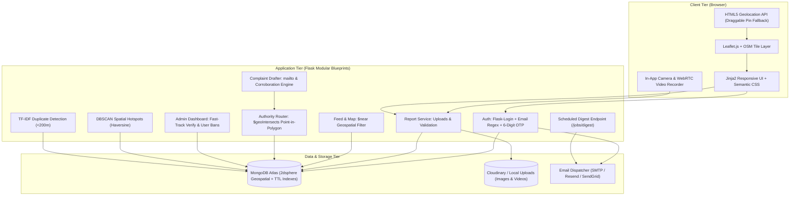

# Geo-Tagged Civic Issue Reporter (GCIR)

[](https://www.python.org/)
[](LICENSE)
[](tests/)
[](https://www.mongodb.com/cloud/atlas)
[-orange.svg)](data/)

> **Community-verified, geo-spatial civic grievance platform.**  
> Residents report geo-tagged civic problems (potholes, garbage dumps, water leaks, broken streetlights), nearby neighbors verify them with upvotes, and upon reaching the verification threshold (10 votes), the system automatically performs hierarchical point-in-polygon spatial routing to draft and address formal complaint emails to the exact responsible authority (Ward > Sector > District > State).

[**Live Demo on Render**](https://geo-tagged-civic-issue-reporter.onrender.com)

---

## 🌟 Key Capabilities

1. **High-Precision Geo-Reporting & Multimedia Capture**:
   - **Dual Evidence Submission**: Upload existing photos/videos or capture live in-browser.
   - **In-App Camera & Video Recorder**: WebRTC live viewfinder supporting front/back camera flipping (`🔄 Flip Camera`), one-tap photo snapping, and 10-second video recording with real-time countdown progress.
   - **HTML5 Geolocation & Interactive Map**: Auto-detects GPS coordinates with an interactive Leaflet draggable pin fallback. EXIF GPS metadata is isolated/untrusted for tamper resistance.

2. **Email Format Validation & 6-Digit OTP Verification**:
   - **Strict Syntax Validation**: RFC 5322-compliant email format validation enforced across both sign-up and login.
   - **OTP Ownership Verification**: Cryptographically secure 6-digit verification code (`secrets.randbelow(900000) + 100000`) dispatched via SMTP / SendGrid / Resend.
   - **Staged Registration & TTL Cleanup**: Pending sign-ups are staged with hashed passwords and auto-purged after 15 minutes using MongoDB TTL indexes.
   - **Anti-Spam Resend Protection**: Dedicated OTP input screen with a 30-second cooldown on code resend requests.

3. **Community Verification Engine**:
   - Enforces `VERIFY_THRESHOLD = 10` upvotes before complaint routing is unlocked.
   - One upvote per account; authors cannot upvote their own reports.
   - Soft proximity check (~5 km): votes from distant locations are accepted but flagged for audit.
   - Visual progress bars transitioning dynamically from progress blue to verified green.

4. **Hierarchical Authority Complaint Router**:
   - Point-in-polygon spatial queries (`$geoIntersects`) resolving exact administrative boundaries: **250 MCD Wards (2022 Delimitation)**, NDMC, Noida Authority, and Ghaziabad Nagar Nigam.
   - Specificity priority: `ward` > `sector` > `district` > `state` with automatic supervisory fallback.
   - One-click `mailto:` dispatch and clipboard copy with pre-filled details, coordinates, photos/videos, upvote metrics, and corroborating issue counts (<200m).

5. **Civic Administration & Moderation Dashboard**:
   - **Interactive Quick-Filter Tabs**: Filter instantly by *Total Reports*, *Community Verified*, *Complaints Filed*, *Registered Users*, and *Flagged Queue*.
   - **Fast-Track Verification**: Administrators can instantly verify urgent civic hazards without waiting for 10 community votes.
   - **Content Moderation**: One-click removal of fraudulent or inappropriate reports from the public feed.
   - **User Role & Ban Management**: Super Admins can promote/demote users between Resident and Moderator roles, suspend/ban malicious accounts, and permanently delete accounts with complete cascade cleanup.

6. **Resident Profile & Session Persistence**:
   - 30-day persistent session cookies with `HttpOnly` and `SameSite=Lax` security attributes (prevents accidental logout on page refresh).
   - Dedicated user profile displaying account credentials, active role badge, list of submitted civic reports, and account self-deletion options.

7. **Scheduled Neighborhood Email Digest**:
   - Token-secured endpoint (`/jobs/digest`) scheduled to run periodically or manually dispatched via Admin panel.
   - Groups unverified issues within each opted-in resident's radius (capped at 5 items).
   - Strict duplicate suppression via `digest_log` and exclusion of user's own/upvoted issues.

8. **Data & ML Analytics**:
   - **Hotspot Detection**: DBSCAN clustering using the Haversine metric on radian coordinates to locate dense civic problem zones.
   - **Duplicate Detection**: Spatial radius candidate filter (<200m) paired with calibrated bi-gram TF-IDF cosine similarity (**100% Precision**, **70% Recall**, **0.8235 F1-Score**).

---

## 🏗️ Architecture



---

## 🚀 Quickstart Guide

### 1. Prerequisites
- Python 3.11+ (Tested on Python 3.13)
- Git

### 2. Environment Setup
```bash
# Clone the repository
git clone https://github.com/<your-username>/Geo-TaggedCivicIssueReporter.git
cd Geo-TaggedCivicIssueReporter

# Create and activate virtual environment
python -m venv .venv
# On Windows:
.venv\Scripts\activate
# On Linux/macOS:
source .venv/bin/activate

# Install dependencies
pip install -r requirements.txt
```

### 3. Environment Variables
Copy `.env.example` to `.env`:
```bash
cp .env.example .env     # On Linux/macOS
copy .env.example .env   # On Windows
```

Key configuration settings:
- `MONGODB_URI`: Your MongoDB Atlas connection string (or leave default for local in-memory fallback).
- `USE_CLOUDINARY`: `True` with Cloudinary credentials for permanent media hosting, or `False` for local dev.
- `EMAIL_BACKEND`: `mock` (logs to console), `smtp` (for Gmail/standard SMTP), `resend`, or `sendgrid`.
- `SMTP_HOST`, `SMTP_PORT`, `SMTP_USER`, `SMTP_PASSWORD`: SMTP credentials for live transactional OTP verification emails.
- `CRON_SECRET_TOKEN`: Secret token protecting the periodic digest endpoint.

### 4. Compile Boundaries & Seed Demo Data
```bash
# 1. Ingest, validate, and repair administrative boundaries
python scripts/etl_boundaries.py

# 2. Seed realistic demo users, issues, and clusters across Delhi-NCR (optional)
python scripts/seed_demo_data.py
```

### 5. Run Development Server
```bash
python wsgi.py
```
Open **http://localhost:5000** in your browser.

---

## 🔐 Admin Account Setup

To create or update a secure administrator account, run the CLI utility:

```bash
python scripts/create_admin.py
```
This securely prompts you for your admin email and password (passwords are securely hashed with PBKDF2:SHA256 and never committed to version control).

### Database Cleanup & Production Reset
To wipe demo reports and test accounts from your database (while preserving official municipal boundary jurisdictions):
```bash
python scripts/clean_demo_data.py
```

---

## 🧪 Testing & Validation

### Run Full Test Suite (36 Tests)
```bash
python -m pytest tests/ -v
```
All **36 automated unit and integration tests** run deterministically in isolated memory using `mongomock` with zero external database dependencies:
- **Authentication & Roles**: Password hashing, duplicate email handling, session management.
- **Email Validation & OTP**: Regex syntax tests, OTP generation, 15-min expiration, and resend cooldown.
- **Reports & Verification**: GeoJSON coordinate validation, proximity checks, 10-vote threshold flip.
- **Camera & Video Support**: File upload constraints, WebM/MP4 storage, and embedded player rendering.
- **Admin Panel**: Fast-track verification, tab switching, and role management.
- **Authority Router & Complaints**: Point-in-polygon routing across MCD Wards and draft generation.
- **Machine Learning**: DBSCAN clustering and TF-IDF duplicate identification.

---

## 🌐 Production Deployment (Render)

1. Connect your repository to **[Render.com](https://render.com)**.
2. Select **New Web Service** and link this repository.
3. Configuration:
   - **Runtime:** `Python`
   - **Build Command:** `pip install -r requirements.txt && python scripts/etl_boundaries.py`
   - **Start Command:** `gunicorn wsgi:app`
4. Environment Variables:
   - `MONGODB_URI`: `<Your MongoDB Atlas connection string>`
   - `DATABASE_NAME`: `gcir_db`
   - `SECRET_KEY`: `<Random secret string>`
   - `CRON_SECRET_TOKEN`: `<Random cron secret>`
   - `USE_CLOUDINARY`: `True` (with Cloudinary API keys)
   - `EMAIL_BACKEND`: `smtp` (or `resend`/`sendgrid`)
   - `SMTP_HOST`: `smtp.gmail.com`
   - `SMTP_PORT`: `587`
   - `SMTP_USER`: `<Your email>`
   - `SMTP_PASSWORD`: `<Your Google App Password>`
   - `SMTP_USE_TLS`: `True`
5. Schedule the digest job every 6 hours via an external cron scheduler (e.g., [cron-job.org](https://cron-job.org)) by sending a `POST` request to `https://<your-app>.onrender.com/jobs/digest` with header `X-Job-Token: <CRON_SECRET_TOKEN>`.

---

## 📄 License
This project is licensed under the [MIT License](LICENSE).
