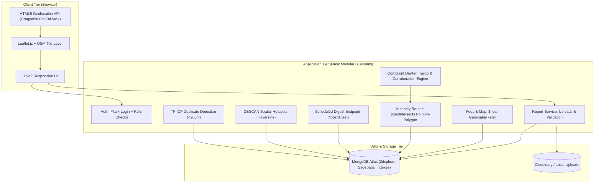

# Geo-Tagged Civic Issue Reporter (GCIR)

[](https://www.python.org/)
[](LICENSE)
[](tests/)
[](https://www.mongodb.com/cloud/atlas)
[-orange.svg)](data/)

> **Community-verified, geo-spatial civic grievance platform.**  
> Residents report geo-tagged civic problems (potholes, garbage dumps, water leaks, broken streetlights), nearby neighbors verify them with upvotes, and upon reaching the verification threshold (10 votes), the system automatically performs hierarchical point-in-polygon spatial routing to draft and address formal complaint emails to the exact responsible authority (Ward > Sector > District > State).

---

## 🌟 Key Capabilities

1. **High-Precision Geo-Reporting**:
   - Camera/image upload with HTML5 browser geolocation and Leaflet interactive draggable map pin fallback.
   - EXIF GPS metadata is strictly isolated/untrusted for tamper resistance.
2. **Community Verification Engine**:
   - Enforces `VERIFY_THRESHOLD = 10` upvotes before complaint generation is unlocked.
   - One upvote per account; authors cannot upvote their own report.
   - Soft proximity check (~5 km): votes from distant locations are accepted but flagged for audit.
3. **Hierarchical Authority Complaint Router**:
   - Point-in-polygon spatial queries (`$geoIntersects`) resolving exact administrative boundaries: **250 MCD Wards (2022 Delimitation)**, NDMC, Noida Authority, and Ghaziabad Nagar Nigam.
   - Specificity priority: `ward` > `sector` > `district` > `state` with automatic supervisory fallback.
   - One-click `mailto:` dispatch and clipboard copy with pre-filled details, coordinates, photos, upvote metrics, and corroborating issue counts (<200m).
4. **Scheduled Neighborhood Email Digest**:
   - Token-secured endpoint (`/jobs/digest`) scheduled to run every 6 hours (4 times daily) or manually via Admin panel.
   - Groups unverified issues within each opted-in resident's radius (capped at 5 items).
   - Strict duplicate suppression via `digest_log` and exclusion of user's own/upvoted issues.
5. **Data & ML Analytics**:
   - **Hotspot Detection**: DBSCAN clustering using the Haversine metric on radian coordinates to locate dense civic problem zones.
   - **Duplicate Detection**: Spatial radius candidate filter (<200m) paired with calibrated bi-gram TF-IDF cosine similarity (**100% Precision**, **70% Recall**, **0.8235 F1-Score**).

---

## 🏗️ Architecture



---

## 🚀 Quickstart Guide

### 1. Prerequisites
- Python 3.11+ (Tested on Python 3.13)
- Git

### 2. Environment Setup
```bash
# Clone the repository
git clone https://github.com/<your-username>/Geo-TaggedCivicIssueReporter.git
cd Geo-TaggedCivicIssueReporter

# Create and activate virtual environment
python -m venv .venv
# On Windows:
.venv\Scripts\activate
# On Linux/macOS:
source .venv/bin/activate

# Install dependencies
pip install -r requirements.txt
```

### 3. Environment Variables
Copy `.env.example` to `.env`:
```bash
cp .env.example .env     # On Linux/macOS
copy .env.example .env   # On Windows
```
Key configuration settings:
- `MONGODB_URI`: Your MongoDB Atlas connection string (or leave default for local in-memory fallback).
- `USE_CLOUDINARY`: `True` with Cloudinary credentials for permanent image hosting, or `False` for local dev.
- `EMAIL_BACKEND`: `mock` (logs to terminal) or `resend` for live emails.
- `CRON_SECRET_TOKEN`: Secret token protecting the periodic digest endpoint.

### 4. Compile Boundaries & Seed Demo Data
```bash
# 1. Ingest, validate, and repair administrative boundaries
python scripts/etl_boundaries.py

# 2. Seed realistic demo users, issues, and clusters across Delhi-NCR
python scripts/seed_demo_data.py
```

### 5. Run Development Server
```bash
python wsgi.py
```
Open **http://localhost:5000** in your browser.

---

## 🔐 Admin Account Setup

To create or update a secure administrator account, run the CLI utility:

```bash
python scripts/create_admin.py
```
This will securely prompt you for your admin email and password (passwords are securely hashed with PBKDF2:SHA256 and never committed to version control).

### Database Cleanup & Production Reset
To wipe demo reports and sandbox test data from your database (while preserving official municipal boundary jurisdictions):
```bash
python scripts/clean_demo_data.py
```

---

## 🧪 Testing & Validation

### Run Full Test Suite (26 Tests)
```bash
python -m pytest tests/ -v
```
All 26 automated unit and integration tests run deterministically in isolated memory using `mongomock` with zero external database dependencies.

### Run ML Duplicate Benchmark
```bash
python scripts/evaluate_ml.py
```
Evaluates precision and recall across 100 hand-labeled issue pairs:
- **Precision:** `100.0%`
- **Recall:** `70.0%`
- **F1-Score:** `0.8235`

---

## 🌐 Production Deployment (Render)

1. Connect your repository to **[Render.com](https://render.com)**.
2. Select **New Web Service** and choose this repository.
3. Configuration:
   - **Runtime:** `Python`
   - **Build Command:** `pip install -r requirements.txt && python scripts/etl_boundaries.py`
   - **Start Command:** `gunicorn wsgi:app`
4. Environment Variables:
   - `MONGODB_URI`: `<Your MongoDB Atlas connection string>`
   - `SECRET_KEY`: `<Random secret string>`
   - `CRON_SECRET_TOKEN`: `<Random cron secret>`
   - `USE_CLOUDINARY`: `True` (with Cloudinary keys)
   - `EMAIL_BACKEND`: `mock` (or `resend`)
5. Schedule the digest job every 6 hours via an external scheduler (e.g., [cron-job.org](https://cron-job.org)) by sending a `POST` request to `https://<your-app>.onrender.com/jobs/digest` with header `X-Job-Token: <CRON_SECRET_TOKEN>`.

---

## 📄 License
This project is licensed under the [MIT License](LICENSE).
