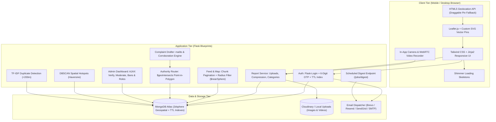

# Garuda — Civic Grievance & Neighborhood Tracking Platform


[](https://www.python.org/)
[](LICENSE)
[](tests/)
[](https://www.mongodb.com/cloud/atlas)
[](https://tailwindcss.com/)
[-teal.svg)](data/)

> **"See the change. Be the change!"**  
> **Garuda** is a community-driven, geo-spatial civic grievance platform. Residents report geo-tagged civic problems (potholes, garbage dumps, water leaks, broken streetlights), nearby neighbors verify them with upvotes, and upon reaching the verification threshold (10 votes), the platform automatically performs hierarchical point-in-polygon spatial routing to draft and address formal complaint emails to the exact responsible authority (Ward > Sector > District > State).

[**Live Demo on Render**](https://garuda-62ty.onrender.com)

---

## 🌟 Key Capabilities & Features

### 1. High-Precision Geo-Reporting & Multimedia Capture
- **Dual Evidence Submission**: Upload existing photos/videos or capture live in-browser.
- **In-App Camera & WebRTC Video Recorder**: WebRTC live viewfinder supporting front/back camera flipping (`🔄 Flip Camera`), one-tap photo snapping, and 10-second video recording with real-time countdown progress.
- **HTML5 Geolocation & Interactive Map**: Auto-detects GPS coordinates with an interactive Leaflet draggable pin fallback. EXIF GPS metadata is isolated/untrusted for tamper resistance.
- **Client-Side Media Compression**: In-browser HTML5 Canvas downscaling and JPEG compression before upload to conserve mobile bandwidth.

### 2. Smooth Chunk-Based Feed & Infinite Scrolling
- **Subsequent Chunk Pagination**: Initial visit loads 10 reports; scrolling down seamlessly streams 5 reports per chunk via lightweight HTML partials (`_cards.html`, `_sentinel.html`).
- **Visual Upvote & Liked State Distinction**: Persistent visual feedback distinguishes liked reports from unliked reports with a filled rose heart icon, pill background, and real-time state sync across infinite scroll chunks.
- **Adjustable Neighborhood Radii**: Residents can set their neighborhood radius (5km, 10km, 15km, 20km, 25km, 30km).
- **Dedicated Community Feed**: Fixed 100km metropolitan radius feed providing broader regional visibility.
- **Dynamic Sorting & Filtering**: Sort without page reloads by *Most Liked*, *Newest*, *Reported*, *Pending Verification*, *Verified*, or *Distance (Closest to Farthest)*.
- **Shimmer Loading Skeletons**: CSS-animated pulsing placeholders (`_skeleton.html`) eliminate Content Layout Shift (CLS) during filter updates and chunk pagination.

### 3. Instant (Zero-Reload) Social Reactions & Share Action Sheet
- **Optimistic Likes & Comments**: Upvoting and commenting update instantly in the DOM via background fetch calls without disrupting the user's scroll position.
- **Social Share Action Sheet**: Native Web Share API integration with an Action Sheet modal fallback offering one-tap sharing to WhatsApp, X (Twitter), Facebook, and clipboard copy.

### 4. Email Validation & 6-Digit OTP Verification
- **Strict RFC 5322 Syntax Validation**: Validates email integrity across sign-up, login, and password management.
- **Cryptographic 6-Digit OTP**: Secure numeric codes (`secrets.randbelow(900000) + 100000`) dispatched via Brevo, Resend, SendGrid, or SMTP.
- **Notification Anti-Snippet Privacy Protection**: Uses zero-width invisible padding and preheaders so lock-screen notifications and inbox preview snippets never expose OTP verification codes.
- **Enhanced Auth UX & Validation**: Password visibility toggle button (eye icon), real-time mandatory field indicators (`*`), interactive red-outline error states upon empty submission, and high-visibility translucent CTA buttons.
- **Staged Registration & TTL Cleanup**: Pending sign-ups are stored with securely hashed passwords and auto-purged after 15 minutes via MongoDB TTL indexes.
- **Anti-Spam Resend Protection**: Cooldown timer (30 seconds) prevents email flooding.

### 5. Secure Password Reset & Recovery System (Brevo Transactional Integration)
- **Account Enumeration Defense**: `POST /api/auth/forgot-password` and Web UI consistently return a uniform generic notice (`"If an account exists for this email, password reset instructions have been sent."`) regardless of whether the account exists or if transactional dispatch encounters provider issues.
- **Cryptographic Token Hashing (SHA-256)**: Reset tokens are generated using cryptographically secure entropy (`secrets.token_urlsafe(32)`). Raw reset tokens are strictly never stored in the database or written to server logs; only SHA-256 hashes (`password_reset_token_hash`) are persisted.
- **Strict 30-Minute Expiry & Single-Use Invalidation**: Tokens expire automatically in 30 minutes. Upon a successful reset or upon a newer reset request, existing tokens are immediately and atomically invalidated (`$unset`).
- **Adaptive Rate Limiting & Abuse Prevention**: Sliding-window rate limiter restricts reset requests by both client IP (max 10 requests / 15 mins) and account email (max 5 requests / 15 mins), returning HTTP 429 to mitigate automated credential and inbox spam attacks.
- **Password Strength Rules & Secure Hashing**: Enforces length constraints (6–128 characters), confirmation matching, and hashes using Werkzeug's adaptive algorithm (`scrypt`/`pbkdf2`). Plaintext passwords are never stored.
- **Dual API & Responsive Web Flow**: Complete RESTful API endpoints (`POST /api/auth/forgot-password`, `GET/POST /api/auth/reset-password`) and user-friendly server-rendered views with client-side real-time strength/matching feedback, interactive submit spinners, and password visibility toggles.
- **Automatic Expired Token Purging**: Database cleanup utility (`cleanup_expired_reset_tokens`) purges expired tokens from user profiles.

### 6. Dedicated Life Hazard Emergency Flow & First-Responder Directory
- **Minimal High-Speed Submission**: Auto-captures high-accuracy GPS coordinates; description and photo attachments are completely optional to ensure rapid reporting during imminent threats.
- **Zero Moderation Delays & Deduplication Bypass**: Bypasses the moderation queue and duplicate merging delays. Duplicates are treated as immediate corroboration rather than merged, providing real-time corroboration metrics to first responders.
- **Optional Direct Authority Dispatch Checkbox**: Users can toggle `☑ Dispatch this report to the concerned authority` (`From: Garuda`, `To: Concerned Authority`, `Reply-To: User's verified email`). This avoids unnecessary email dispatches if single-call resolution is already handled.
- **1 km Neighborhood Proximity Alerts**: Automatically emails residents within a 1 km radius (verified via last login coordinates with fallback to home location), embedded with direct links to the live report.
- **Direct 112 Emergency Dialer**: Dedicated high-contrast red button (`Call 112 (National)`) that directly triggers the device dialer with the national emergency number.
- **Static Offline Emergency Directory**: Instant bottom action sheet opening without network calls or API dependencies, providing one-tap dialers for:
  - **Police**: `112`
  - **Fire**: `101`
  - **Ambulance**: `102`
  - **Children in Difficult Situations (Childline)**: `1098`
  - **LPG Gas Leak Helpline**: `1906`
  - **Disaster Management Services**: `108`
- **Abuse Rate Limiting**: Capped at 5 life hazard reports per user per hour.
- **Top Priority & Escalation Timers**: Pinned at the top of all views and automatically escalates if unacknowledged within 60 minutes.

### 7. Community Verification & Immediate Complaint Filing
- **Verification Milestone**: Reports that reach 10 community upvotes receive a distinct "Community Verified" emerald status tag.
- **Immediate Complaint Access**: Removed artificial 10-vote hard limits—residents can generate and dispatch formal complaints to responsible authorities immediately upon reporting without delay.
- Soft proximity check (~5 km) flags distant votes for audit while maintaining democratic participation.

### 8. Hierarchical Authority Complaint Router
- Point-in-polygon spatial queries (`$geoIntersects`) resolving exact administrative boundaries: **250 MCD Wards (2022 Delimitation)**, NDMC, Noida Authority, and Ghaziabad Nagar Nigam.
- Specificity priority: `ward` > `sector` > `district` > `state` with automatic supervisory fallback.
- One-click `mailto:` dispatch and clipboard copy with pre-filled details, coordinates, photos/videos, upvote metrics, and corroborating issue counts (<200m).

### 9. Interactive Geospatial Map & User Location Pinpoint
- **Distinct White User Pointer**: Visual pinpoint marker displaying the user's live coordinates with their avatar or initials for easy orientation.
- **100 km Metro Coverage Circle**: Dynamic radar circle displaying the coverage boundary on both the feed radar and interactive full-screen map views.

### 10. Civic Administration & Smooth Moderation Dashboard
- **Zero-Disruption Report Removal**: When an administrator deletes an inappropriate or resolved report, it is permanently removed from the database and feed without freezing or forcing reloads on active users scrolling through the feed.
- **AJAX Actions (Zero-Reload)**: Instant verification, status updates, content moderation (unflag/remove), user role modification (Resident &harr; Moderator), and ban toggles without page reloads.
- **Interactive Quick-Filter Tabs**: Filter instantly by *Total Reports*, *Community Verified*, *Complaints Filed*, *Registered Users*, and *Flagged Queue*.

### 11. Resident Profile & Civic Dashboard
- **Session Persistence**: 30-day persistent session cookies with `HttpOnly` and `SameSite=Lax` security attributes.
- **Civic Engagement Stats**: Tracks total reports, resolved count, in-progress items, upvotes cast, and average municipal response times.
- **Lightweight DB Projections**: Optimized MongoDB queries fetch only essential user dashboard fields.

### 12. Scheduled Neighborhood Email Digest
- Token-secured endpoint (`/jobs/digest`) scheduled to run periodically or manually dispatched via Admin panel.
- Groups unverified issues within each opted-in resident's radius (capped at 5 items).
- Strict duplicate suppression via `digest_log` and exclusion of user's own/upvoted issues.

### 13. Data & ML Analytics
- **Hotspot Detection**: DBSCAN clustering using the Haversine metric on radian coordinates to locate dense civic problem zones.
- **Duplicate Detection**: Spatial radius candidate filter (<200m) paired with calibrated bi-gram TF-IDF cosine similarity (**100% Precision**, **70% Recall**, **0.8235 F1-Score**).

---

## ⚡ Performance & Bandwidth Optimizations

- **Absolute Lazy Video Loading**: Video elements do not download media bytes on page load; only a lightweight poster thumbnail is displayed until the user presses play.
- **Lazy Image Loading**: Images utilize `loading="lazy"` and `decoding="async"` attributes to preserve network bandwidth on mobile connections.
- **Debounced Geospatial Leaflet Pan**: Map movement and zoom events are debounced (300ms) to eliminate redundant spatial rendering and tile fetch bottlenecks.
- **Zero-Network Vector Map Pins**: Custom SVG map pin DivIcons rendered purely via CSS and inline SVG, replacing external image asset requests.
- **Non-Blocking Async Email Dispatch**: Transactional emails run in background worker threads (`ThreadPoolExecutor`) preventing HTTP request timeouts.
- **Dual-Port SMTP Fallback**: Automatic failover between Port 587 (STARTTLS) and Port 465 (SSL) with automatic API detection for Brevo, Resend, and SendGrid on serverless/cloud environments (e.g. Render Free Tier).

---

## 🔍 SEO & Web Standards

- **Open Graph & Twitter Cards**: Comprehensive `og:site_name`, `og:title`, `og:description`, `og:image`, `twitter:card="summary_large_image"` tags for rich link previews.
- **Schema.org Structured Data**: JSON-LD `WebApplication` metadata embedded on all core entry pages.
- **Search Engine Crawlers**: Dynamic `/robots.txt` and `/sitemap.xml` routes.
- **App Icons & Favicon Suite**: Master eagle brand emblem exported across all standard formats:
  - `favicon.ico` (32x32 multi-resolution)
  - `favicon.png` (32x32) & `favicon-64.png` (64x64)
  - `apple-touch-icon.png` (180x180)
  - `icon-192.png` & `icon-512.png` (PWA / Android icons)
  - `garuda-banner.jpg` (1024x537 social preview card)

---

## 🛠️ Tech Stack

| Domain | Technology / Library | Role |
|---|---|---|
| **Backend Framework** | Python 3.11–3.13, Flask 3.x | Modular blueprint routing, application factory, WSGI entrypoint |
| **Authentication** | Flask-Login, Werkzeug | Session management (30-day HttpOnly/SameSite), password hashing (PBKDF2:SHA256) |
| **Database & GIS** | MongoDB Atlas, PyMongo | GeoJSON `2dsphere` indexes (`$nearSphere`, `$geoIntersects`), TTL indexes |
| **Frontend Styling** | Tailwind CSS v3.4, Vanilla CSS | Utility-first CSS, responsive dark navigation, custom components, responsive grids |
| **Mapping & Location** | Leaflet.js, OpenStreetMap | Interactive draggable pin picker, locality radar maps, full-screen map overview |
| **Media & Audio/Video**| WebRTC MediaDevices API, HTML5 Canvas | Browser camera flipping, 10s video recording, client-side downscaling |
| **Machine Learning** | Scikit-Learn, NumPy | DBSCAN (Haversine spatial hotspots), TF-IDF bi-grams (duplicate detection) |
| **Email Delivery** | Brevo REST API, Resend, SendGrid, SMTPLib | Transactional OTP verification & neighborhood digests with async threading |
| **Cloud Storage** | Cloudinary SDK | Cloud media hosting with automatic delivery optimization |
| **Testing** | Pytest, Mongomock | 58 in-memory unit and integration tests with deterministic isolation |

---

## 🏗️ Architecture


```mermaid
flowchart TD
    subgraph Client["Client Tier (Mobile / Desktop Browser)"]
        UI["Tailwind CSS + Jinja2 Responsive UI"]
        SKELETON["Shimmer Loading Skeletons"]
        CAMERA["In-App Camera & WebRTC Video Recorder"]
        LEAFLET["Leaflet.js + Custom SVG Vector Pins"]
        GEO["HTML5 Geolocation API (Draggable Pin Fallback)"]
    end

    subgraph App["Application Tier (Flask Blueprints)"]
        AUTH["Auth: Flask-Login + 6-Digit OTP + TTL Index"]
        REPORTS["Report Service: Uploads, Compression, Categories"]
        FEED["Feed & Map: Chunk Pagination + Radius Filter ($nearSphere)"]
        ROUTER["Authority Router: $geoIntersects Point-in-Polygon"]
        COMPLAINTS["Complaint Drafter: mailto & Corroboration Engine"]
        ADMIN["Admin Dashboard: AJAX Verify, Moderate, Bans & Roles"]
        JOBS["Scheduled Digest Endpoint (/jobs/digest)"]
        ML_HOTSPOTS["DBSCAN Spatial Hotspots (Haversine)"]
        ML_DUPES["TF-IDF Duplicate Detection (<200m)"]
    end

    subgraph Storage["Data & Storage Tier"]
        MONGO[("MongoDB Atlas (2dsphere Geospatial + TTL Indexes)")]
        IMG[("Cloudinary / Local Uploads (Images & Videos)")]
        EMAIL["Email Dispatcher (Brevo / Resend / SendGrid / SMTP)"]
    end

    UI --> SKELETON
    UI --> AUTH
    AUTH --> EMAIL
    AUTH --> MONGO
    CAMERA --> REPORTS
    GEO --> LEAFLET --> UI
    UI --> REPORTS --> IMG
    REPORTS --> MONGO
    FEED --> MONGO
    COMPLAINTS --> ROUTER --> MONGO
    ADMIN --> MONGO
    JOBS --> EMAIL
    ML_HOTSPOTS --> MONGO
    ML_DUPES --> MONGO
```

---

## 🚀 Quickstart Guide

### 1. Prerequisites
- Python 3.11+ (Tested on Python 3.13)
- Node.js 18+ & npm (for Tailwind CSS asset compilation)
- Git

### 2. Environment Setup
```bash
# Clone the repository
git clone https://github.com/Kaisel-adi/final-project.git
cd final-project

# Create and activate virtual environment
python -m venv .venv
# On Windows:
.venv\Scripts\activate
# On Linux/macOS:
source .venv/bin/activate

# Install Python dependencies
pip install -r requirements.txt

# Install frontend dependencies and build CSS
npm install
npm run build:css
```

### 3. Environment Variables
Copy `.env.example` to `.env`:
```bash
cp .env.example .env     # On Linux/macOS
copy .env.example .env   # On Windows
```

Key configuration settings:
- `MONGODB_URI`: Your MongoDB Atlas connection string (or leave default for local in-memory fallback).
- `USE_CLOUDINARY`: `True` with Cloudinary credentials for permanent media hosting, or `False` for local dev.
- `EMAIL_BACKEND`: `mock` (logs to console), `brevo`, `resend`, `sendgrid`, or `smtp`.
- `BREVO_API_KEY`: API key for HTTPS-based email dispatch (recommended for cloud hosts like Render).
- `SMTP_HOST`, `SMTP_PORT`, `SMTP_USER`, `SMTP_PASSWORD`: SMTP credentials for live transactional OTP verification emails.
- `CRON_SECRET_TOKEN`: Secret token protecting the periodic digest endpoint.

### 4. Compile Boundaries & Seed Demo Data
```bash
# 1. Ingest, validate, and repair administrative boundaries
python scripts/etl_boundaries.py

# 2. Seed realistic demo users, issues, and clusters across Delhi-NCR (optional)
python scripts/seed_demo_data.py
```

### 5. Run Development Server
```bash
python wsgi.py
```
Open **http://localhost:5000** in your browser.

---

## 🔐 Admin Account Setup

To create or update a secure administrator account, run the CLI utility:

```bash
python scripts/create_admin.py
```
This securely prompts you for your admin email and password (passwords are securely hashed with PBKDF2:SHA256 and never committed to version control).

### Database Cleanup & Production Reset
To wipe demo reports and test accounts from your database (while preserving official municipal boundary jurisdictions):
```bash
python scripts/clean_demo_data.py
```

---

## 🧪 Testing & Validation

### Run Full Test Suite (121 Tests)
```bash
python -m pytest tests/ -v
```
All **121 automated unit and integration tests** run deterministically in isolated memory using `mongomock` with zero external database dependencies:
- **Authentication & Roles**: Password hashing, duplicate email handling, session management.
- **Email Validation & OTP**: Regex syntax tests, OTP generation, 15-min expiration, and resend cooldown.
- **Secure Password Reset**: Cryptographic token hashing (SHA-256), 30-min expiration, anti-enumeration generic responses, sliding-window rate limiting (IP & email), single-use invalidation, and Brevo delivery failure resilience.
- **Life Hazard Emergency System**: 5-reports/hour rate limiting, immediate corroboration without duplicate delay, optional authority email dispatch, 1 km proximity alert dispatch, 112 dialing, and static action sheet directory rendering.
- **Reports & Verification**: GeoJSON coordinate validation, proximity checks, immediate complaint filing, and verified milestone tags.
- **Camera & Video Support**: File upload constraints, WebM/MP4 storage, and embedded player rendering.
- **Admin AJAX Actions**: Fast-track verification, smooth zero-disruption report removal, tab switching, AJAX role changing, user ban toggles, and content moderation without page reloads.
- **Responsiveness & Performance**: Mobile bottom navigation bars, SVG pins, lazy-loading media, client image compression, debounced maps, user location pinpoint, 100km coverage circle, and static caching headers.
- **Authority Router & Complaints**: Point-in-polygon routing across MCD Wards and draft generation.
- **Machine Learning**: DBSCAN clustering and TF-IDF duplicate identification.
- **WSGI & Keep-Alive Daemon**: Production Render background ping worker threading, startup grace period, and `/health` reachability.

---

## 🌐 Production Deployment (Render)

1. Connect your repository to **[Render.com](https://render.com)**.
2. Select **New Web Service** and link this repository.
3. Configuration:
   - **Runtime:** `Python`
   - **Build Command:** `pip install -r requirements.txt && npm install && npm run build:css && python scripts/etl_boundaries.py`
   - **Start Command:** `gunicorn wsgi:app`
4. Environment Variables:
   - `MONGODB_URI`: `<Your MongoDB Atlas connection string>`
   - `DATABASE_NAME`: `gcir_db`
   - `SECRET_KEY`: `<Random secret string>`
   - `CRON_SECRET_TOKEN`: `<Random cron secret>`
   - `USE_CLOUDINARY`: `True` (with Cloudinary API keys)
   - `EMAIL_BACKEND`: `brevo` (or `resend` / `smtp`)
   - `BREVO_API_KEY`: `<Your Brevo API Key>`
5. Schedule the digest job every 6 hours via an external cron scheduler (e.g., [cron-job.org](https://cron-job.org)) by sending a `POST` request to `https://<your-app>.onrender.com/jobs/digest` with header `X-Job-Token: <CRON_SECRET_TOKEN>`.

---

## 📄 License

**All Rights Reserved.**

This project is not licensed for public reuse, modification, distribution, or commercial use by default.

If you would like to use, modify, distribute, or incorporate any part of this project's source code into another project, please contact the project owner/contributors and obtain explicit permission first.

Permission may be granted on a case-by-case basis.

See the repository's [`LICENSE`](LICENSE) file for the full terms.
